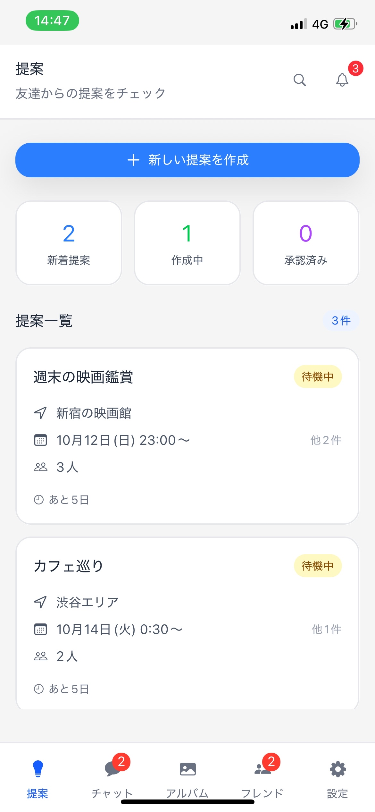

# Recall - 再会のきっかけを作るソーシャルアプリ

   

## 製品概要

### 背景(製品開発のきっかけ、課題等）

「久しく連絡を取っていない知人と再会したい」と思ったことはありませんか？しかし、いざ連絡を取ろうとすると「急に連絡して迷惑では？」「断られたらどうしよう」という心理的ハードルがあります。また、「何をして遊ぼうか」「いつ会えるか」を調整するのも煩雑で、結局連絡を取らずに終わってしまうことが多いのが現状です。

### 製品説明（具体的な製品の説明）

Recall は、過去の写真をもとに AI が再会のきっかけを提案し、匿名での提案システムにより心理的ハードルを下げるソーシャルアプリです。ユーザーが思い出の写真をジャーナルに投稿すると、AI が写真に写っている人物を認識し、その人たちとの再会プランを自動生成してプッシュ通知で提案します。提案は合意が成立するまで匿名で行われるため、「誰が誘ったか」ではなく「何をするか」に焦点を当てることができます。

### 特長

#### 1. AI 駆動の自動提案生成

CLIP モデルによる画像解析と顔認識技術を組み合わせ、過去の写真から適切な再会プランを自動生成。ユーザーは提案を考える手間なく、ワンタップで友人を誘うことができます。

#### 2. 匿名提案システム

合意が成立するまで提案者を匿名にすることで、「誘って断られたら」という心理的ハードルを軽減。全員が「いいね」した場合のみグループが成立し、自然な再会を促進します。

#### 3. 包括的な日程調整機能

提案の合意から日時確定、リマインダー通知まで一気通貫でサポート。Bot を活用した投票システムで、面倒な日程調整を自動化します。

### 解決出来ること

- 知人との再接触における心理的ハードルの解消
- 提案内容を考える負担の軽減（AI による自動生成）
- 複数人での日程調整の煩雑さの解決
- 過去の思い出を活用した自然な再会のきっかけ作り
- フレンド管理とプライバシー保護の両立

### 今後の展望
- バックエンドとフロントエンド側がうまく連携できず，機能の大部分が動作させられなかった．
そのため，チャット機能やフレンド登録，ログイン機能などを実装する．
- ViTといった顔認識技術を使用することで，自動的にフレンドを提案する機能の実装
- 日程調整サポートbotといった，再び集まりやすくする機能の追加
- 実際にデプロイを目指す

### 注力したこと（こだわり等）

- ユーザーの心理的負担を最小限にする UX 設計（匿名提案システム）
- ローカル AI によるプライバシー重視の画像解析機能の実装

## 開発技術

### 活用した技術

- Hagging Face - AIモデル
- FastAPI (Python) - AI サービスとデータ処理
- React Native (Expo) - クロスプラットフォームモバイルアプリ
- OpenCLIP (ViT-B/32) - 画像理解
- ArcFace/MobileFaceNet - 顔認識
- AWS - S3やRDS, EC2等のインフラ技術

#### デバイス

- iOS / Android モバイルデバイス
- Docker - 開発・本番環境

### 独自技術

#### ハッカソンで開発した独自機能・技術

- ローカルLLMを利用したセキュアなAIシステム
- 顔認識データベースとチャット/フレンド管理を連携させた再会サポート基盤
