# ER Database Diagram

```mermaid
erDiagram
    direction LR

    %% Core user ownership
    USERS ||--o{ ASSETS : "owns"
    USERS ||--o{ PROPOSALS : "creates"
    USERS ||--o{ PROPOSAL_PARTICIPANTS : "participates"
    USERS ||--o{ USER_FRIENDSHIPS : "initiates"
    USERS ||--o{ ALBUMS : "creates"
    USERS ||--o{ ALBUM_SHARED_USERS : "shares"
    USERS ||--o{ CHAT_MESSAGES : "sends"
    USERS ||--o{ THEME_SUGGESTIONS : "requests"
    USERS ||--o{ VLM_OBSERVATIONS : "initiates"

    %% Asset-centric relationships
    ASSETS ||--o| IMAGE_EMBEDDINGS : "has"
    ASSETS ||--o{ FACE_EMBEDDINGS : "has"
    ASSETS ||--o{ THEME_SUGGESTIONS : "context"
    ASSETS ||--o{ VLM_OBSERVATIONS : "describes"

    %% Theme vocabulary cluster
    THEME_VOCAB_SETS ||--o{ THEME_VOCAB : "contains"
    THEME_VOCAB ||--o{ THEME_EMBEDDINGS : "embedded as"
    THEME_VOCAB_SETS ||--o{ THEME_SUGGESTIONS : "served from"
    THEME_VOCAB ||--o{ THEME_SUGGESTIONS : "selected"

    %% Proposals and friendships
    PROPOSALS ||--o{ PROPOSAL_PARTICIPANTS : "includes"
    USER_FRIENDSHIPS }o--o{ USERS : "friend of"

    %% Albums and chat
    ALBUMS ||--o{ ALBUM_SHARED_USERS : "shared with"
    ALBUMS ||--o{ ALBUM_PHOTOS : "contains"
    CHAT_MEMBERS ||--o{ CHAT_MESSAGES : "receives"

    %% Vision-Language pipelines
    VLM_OBSERVATIONS ||--o{ VLM_DETECTION_ENTITIES : "produces"

    USERS {
        id int PK
        account_id string
        display_name string
        icon_asset_id string
        face_asset_id string
        profile_text string
    }

    ASSETS {
        id string PK
        owner_id int
        content_type string
        storage_key string
        created_at datetime
    }

    IMAGE_EMBEDDINGS {
        asset_id string PK
        model string
        embedding vector
        created_at datetime
    }

    FACE_EMBEDDINGS {
        id int PK
        asset_id string
        bbox json
        embedding vector
        created_at datetime
    }

    THEME_VOCAB_SETS {
        id int PK
        code string
        lang string
        description string
        is_active bool
        activated_at datetime
        created_at datetime
    }

    THEME_VOCAB {
        id int PK
        set_id int
        name string
        normalized string
        tags json
        created_at datetime
    }

    THEME_EMBEDDINGS {
        theme_id int PK
        model string PK
        embedding vector
        current bool
        created_at datetime
    }

    THEME_SUGGESTIONS {
        id int PK
        user_id int
        asset_id string
        set_id int
        selected_id int
        model string
        topk json
        created_at datetime
    }

    PROPOSALS {
        id int PK
        event_date date
        location string
        creator_id int
        created_at datetime
        deadline_at datetime
    }

    PROPOSAL_PARTICIPANTS {
        proposal_id int PK
        user_id int PK
        status string
        updated_at datetime
    }

    USER_FRIENDSHIPS {
        user_id int PK
        friend_user_id int PK
        status string
        requested_at datetime
        responded_at datetime
    }

    ALBUMS {
        id int PK
        title string
        creator_id int
        created_at datetime
    }

    ALBUM_SHARED_USERS {
        album_id int PK
        user_id int PK
        role string
        added_at datetime
    }

    ALBUM_PHOTOS {
        album_id int PK
        photo_url string PK
        captured_at datetime
        uploaded_at datetime
    }

    CHAT_MEMBERS {
        id int PK
        title string
        icon_url string
        created_at datetime
    }

    CHAT_MESSAGES {
        id int PK
        chat_id int
        sender_id int
        body string
        image_url string
        posted_at datetime
    }

    VLM_OBSERVATIONS {
        observation_id string PK
        asset_id string
        observation_hash string
        model_version string
        prompt_payload json
        schedule_candidates json
        member_candidates json
        notes json
        extra_metadata json
        initiator_user_id int
        latency_ms int
        processed_at datetime
        created_at datetime
        updated_at datetime
    }

    VLM_DETECTION_ENTITIES {
        id int PK
        observation_id string
        entity_type string
        entity_hash string
        payload json
        score float
        extra_metadata json
        created_at datetime
    }
```

## Relationship Notes

- `users` 自身はプロフィール画像として `assets` を参照しつつ、アセットは常に所有者 (`owner_id`) を持ちます。
- テーマ系テーブルはセット → 語彙 → 埋め込みの階層で構成され、サジェストログ (`theme_suggestions`) がそれらと画像を横断的に参照します。
- `proposals` と `proposal_participants`、`user_friendships` でイベント調整や友人関係を記録し、AI 推薦状態 (`recommended`) も保持します。
- ジャーナル機能では `albums` を中心に共有ユーザー・写真小テーブルで構成し、チャット機能は `chat_members` と `chat_messages` で会話ログを管理します。
- VLM 系テーブルは画像解析の観測結果を `vlm_observations` に集約し、検出したエンティティを `vlm_detection_entities` で詳細化します。
